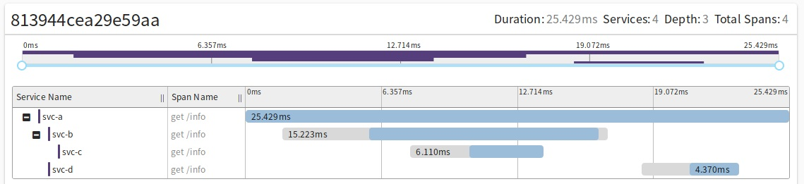

# cloud-k8s

demo，部署在k8s上的多个应用，包括
<li>docker镜像制作</li>
<li>k8s部署yaml</li>
<li>样例工程</li>
 
其中4个样例服务a、b、c、d，调用链如下： 

 

## trace

配置"loud.k8s.x-trace-id.enabled"开启返回header里添加X-cloud-k8s-traceId，示例如下 
< HTTP/1.1 200  
< X-cloud-k8s-traceId: 731e53bbd20376bc 
< Content-Type: application/json;charset=UTF-8 
< Transfer-Encoding: chunked 
< Date: Sat, 27 Jul 2019 07:56:49 GMT 
